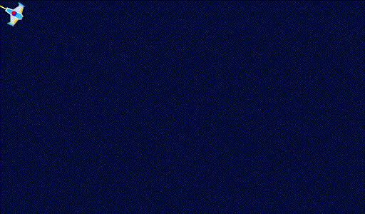

# Godot 2D Top-down Point Click Movement Demo

This project is a demo of how to do smooth rotation and movement for a top-down game using point and click. It allows you to choose various options from the Godot Editor in the supplied Ship scene properties.

## How Demo Works

When the demo is launched you'll see a ship in the center of the window. Just click anywhere in the window and the ship will move towards the red dot that appears.

The ship has some markers on it to demonstrate how accurate or inaccurate some of the options are. How close the ship must be to the final destination or rotation is up to the needs of your game. The markers are: a blue dot at the center of the ship to show how close the ship gets to the red dot (where you clicked), and a yellow line extending from the ship at it's local zero degrees rotation (where it's looking at). These indicator can be turned off in the ship properties.

Note that the max angular and speed affect accuracy. Try the demo with speeds that you'll be using in your game.

You can modify the ship properties in the Godot Engine property inspector while the demo is running to see different options working without having to relaunch the demo.

## Options For Movement and Look At
You can choose from multiple different movement and look at "strategies", combining different ones to see how they seem to work for you. You can also set a flag on the ship scene to complete the look at rotation before movement begins. (Complete list of ship properties below.)

### Movement Strategies

1. None - ship doesn't move
2. Speed - ship moves instantly at max speed - no acceleration or deceleration
3. Acceleration - ship accelerates to max speed - but stops instantly
4. Accel and Decel - ship accelerates and decelerates
5. Lerp Accel - ship's velocity is lerp'ed to max speed - but stops instantly
6. Lerp Position - ship's position is lerp'ed to the target position

### Look At Strategies

1. None - ship doesn't rotate
2. Just Look At - ship instantly looks at target position
3. Lerp Angle - lerp_angle() function used to change rotation smoothly
4. Constant Angle Velocity - rotates smoothly towards target position with a constant angular velocity

## Ship Properties

- Movement Strategy - one of the movement strategies above
- Look At Strategy - one of the look at strategies above
- Speed - max speed of ship
- Acceleration - acceleration or deceleration applied to ships speed (for movement strategies that do acceleration/deceleration)
- Angle Speed Degrees - angular velocity
- Complete Look At First - look at is completed first before movement is started if true/checked. (Lerp Finish Accuracy affects how long look at takes to complete for Lerp Angle.)
- Show Center Indicator - show/hide blue dot on ship
- Show Angle Indicator - show/hid yellow line emanating from ship
- Lerp Rest Of Distance - if true/checked the ship's position is linearly interpolated after the movement strategy is complete. Movement algorithms don't guarantee that the ship will be at the exact location clicked on the screen. This fixes that.
- Lerp Finish accuracy - When using a lerp function it can take a very long time (depending on weight value) to reach the final value. This means that if we check for exact values to tell if we're doing rotating to look at the target, we'll be waiting a while. This option modifies this check to use different approximations.

## How do I use this code?
Any way you want. But most likely you'll want to figure out the behavior you need or want and copy/paste the code into your game, combining the movement and look at into one function. The demo is a lot more complicated because it supports so many options.

## Credits
Ship image is part of the [Space Shooter Redux](https://www.kenney.nl/assets/space-shooter-redux) asset pack from Kenney.nl - license CC0 1.0 Universal.

